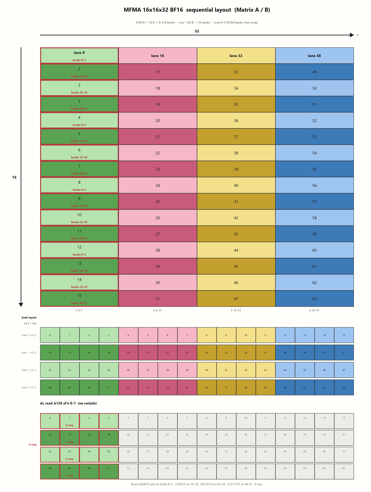
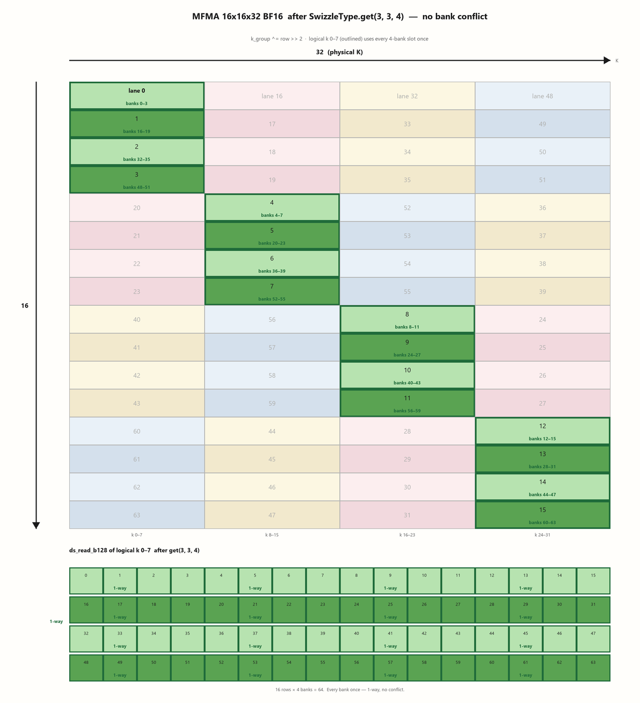
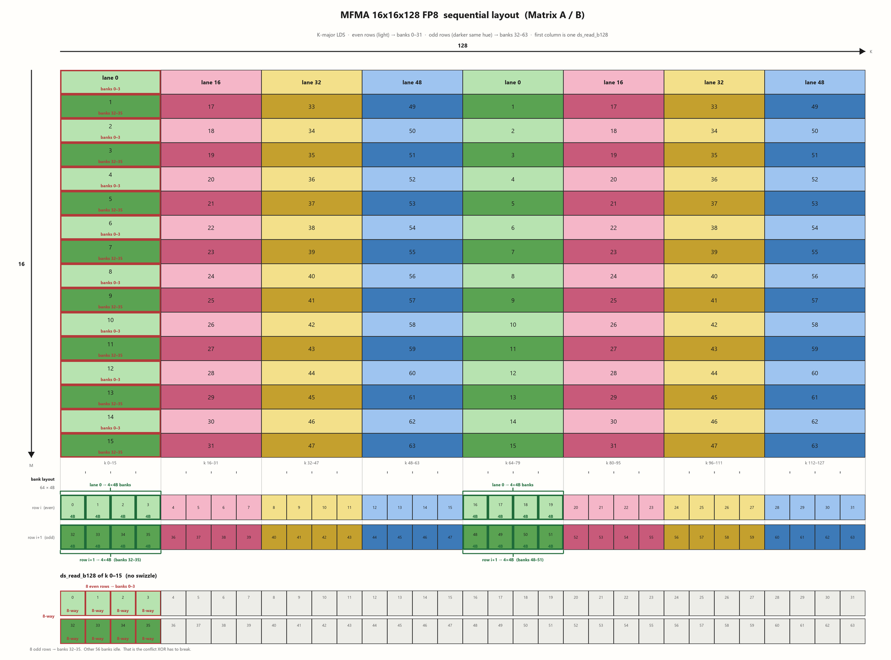
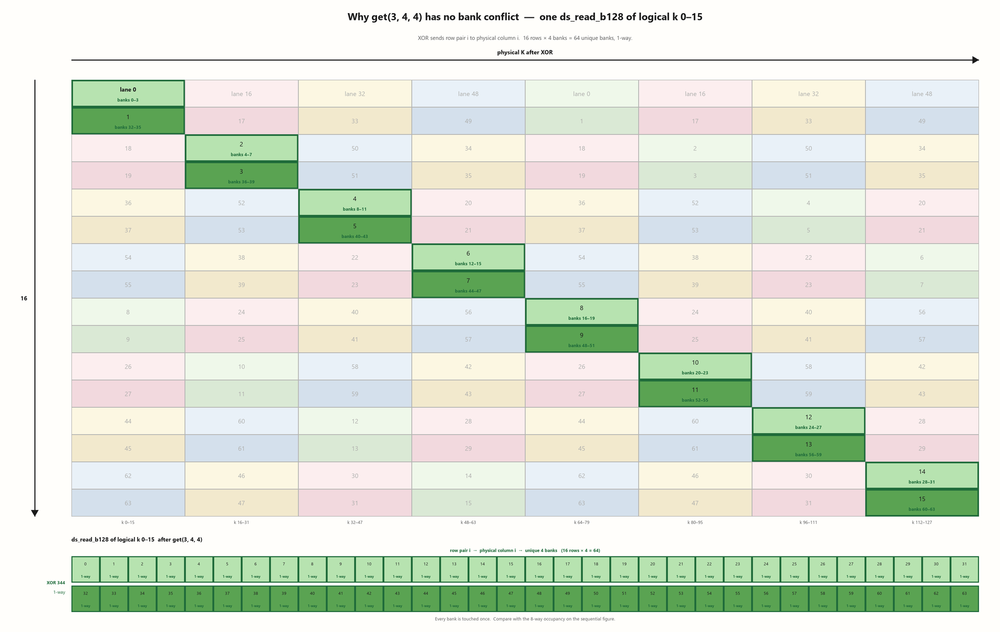

# AMD-GPU 中的 Bank Conflict 解析 (MI355)

MI355X（gfx950 / CDNA4）每个 CU 有 160KB LDS、**64 个 4-byte bank**。一个 bank 一个周期吐 4B，64 × 4B = **256B/cycle**，地址到 bank 就是 `(byte_addr / 4) % 64`。

一次 `ds_read_b128` 是 16B，16 / 4 = 4，正好 4 个连续 bank。在 BF16 的 MFMA 16x16x32 中，一拍是 16 个 lane 各读一份 16B：16 × 16B = 256B。如果这 256B 能拍满 64 个 Bank，就没有 Bank Conflict。
（一个 SIMD 操作实际上分了 4 拍，MI355 Warp Size 是 64）

CuTe / FlyDSL 的 XOR Swizzle 的表达如下：

```text
offset ^= ((offset >> (base + shift)) & ((1 << bits) - 1)) << base
# SwizzleType.get(bits, base, shift)
```

`base` 是 16B DMA 不能动的低位 (对 fp8 来说就是 2^4x1B=16B 对 bf16 来说就是 2^3x2B=16B，注意是按元素为单位算的)，`bits` 是搅几根 bank 槽(直接理解为下图中列数)，`shift` 决定用 row 的哪几位当搅动源 （理解为多少个 Lane 捆绑成一个轮转组）。

## BF16 MFMA 16x16x32 有冲突情况



16×16×32 的 A/B：16 个 lane 各读 16B，实际上一拍只覆盖 16 个 Bank，所以有冲突。

---

## BF16 MFMA 16x16x32 Swizzle234 后无冲突情况

现在设置 Swizzle234:

- bits=2 (2^2 = 4 个列 XOR 轮转)
- base=3 (2^3 x 2B = 16B DMA 原子操作要连续)
- shift=4 (2^4 = 16 个 Lane 捆绑一个轮转组)

这样就一次拍满全部 64 Bank 无冲突了。



---

## FP8 MFMA 16×16×128：有冲突情况



---

## FP8 MFMA 16×16×128：无冲突情况

现在设置 Swizzle234:

- bits=3 (2^3 = 8 个列 XOR 轮转)
- base=4 (2^4 x 1B = 16B DMA 原子操作要连续)
- shift=4 (2^4 = 16 个 Lane 捆绑一个轮转组)


